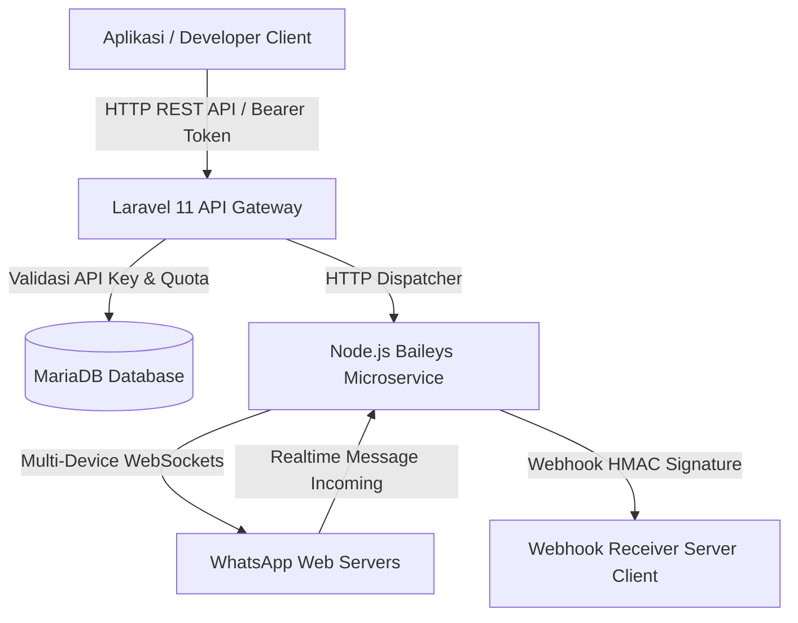

<p align="center">
  <a href="https://github.com/muhammadtsaqf/whatsapp-gateway" target="_blank">
    <div style="font-size: 34px; font-weight: 900; color: #0F172A; letter-spacing: -1.5px; margin-bottom: 4px;">
      WHATSAPP<span style="color: #2563EB;">GATEWAY</span> ENTERPRISE
    </div>
  </a>
  <p align="center">
    <strong>High-Performance Multi-Device WhatsApp Gateway & Developer REST API Engine</strong><br>
    Powered by Laravel 11 (PHP 8.3), Node.js 20 (Baileys v1.0.0 Microservice), & Tailwind CSS v4
  </p>
</p>

<p align="center">
  <a href="https://php.net"></a>
  <a href="https://laravel.com"></a>
  <a href="https://nodejs.org"></a>
  <a href="https://github.com/WhiskeySockets/Baileys"></a>
  <a href="https://tailwindcss.com"></a>
  <a href="LICENSE"></a>
</p>

---

## 📋 Ikhtisar Produk (Overview)

**WhatsApp Gateway Enterprise** adalah platform pengiriman pesan WhatsApp otomatis skala enterprise yang memadukan keandalan **Laravel 11** untuk manajemen pengguna, autentikasi REST API Key, dan kuota harian, serta kecepatan microservice **Node.js (Baileys Engine)** untuk konektivitas WhatsApp Multi-Device secara realtime.

Dirancang untuk developer, startup, dan enterprise yang membutuhkan solusi pengiriman OTP cepat (<800ms), notifikasi tagihan/invoice, serta receiver Webhook realtime tanpa bergantung pada vendor pihak ketiga yang mahal.

---

## ⚡ Instalasi Otomatis (One-Line Script)

Pasang seluruh stack platform (Laravel 11, Node.js 20, MariaDB, Nginx, PM2, Cronjob) di VPS Ubuntu/Debian dalam sekali jalan dengan perintah berikut:

```bash
bash <(curl -sSL https://raw.githubusercontent.com/muhammadtsaqf/whatsapp-gateway/main/installer/install.sh)
```

---

## 🏗️ Arsitektur Sistem (System Architecture)



---

## 🌟 Fitur Unggulan (Core Features)

| Fitur | Deskripsi |
| :--- | :--- |
| **Dual Pair Mode** | Mendukung otentikasi nomor via **Scan QR Code** atau **Pairing Code 8-Digit** tanpa kamera. |
| **Multi-Device Architecture** | Setiap pengguna dapat mengelola banyak sesi nomor WhatsApp terisolasi (UUID Session). |
| **High-Speed REST API v1** | Endpoint pengiriman pesan teks, OTP, serta media berkas (PDF, PNG, JPG, Doc) dengan respon latensi rendah. |
| **Realtime Webhook Dispatcher** | Callback event otomatis (`message.received`, `device.connected`, `device.disconnected`) dengan verifikasi **HMAC SHA-256 Secret Key**. |
| **System Bot Server OTP** | Mode router internal terpusat untuk pengiriman OTP sistem dan notifikasi keamanan. |
| **Daily Quota & Auto-Reset** | Manajemen limit pesan harian & limit perangkat dengan reset cron otomatis pukul **00:05 WIB (Asia/Jakarta)**. |
| **Full-Screen Modern Dashboard** | Antarmuka konsol modern full-screen yang responsif dengan statistik pengiriman realtime. |

---

##  Ringkasan REST API Endpoint

 Base URL: `https://gateway.domain-anda.com/api/v1`

### 1. Kirim Pesan Teks / OTP
- **HTTP Method**: `POST`
- **Endpoint**: `/messages/send-text`
- **Headers**: `Authorization: Bearer <API_KEY>` atau `X-API-Key: <API_KEY>`

**Request Body (JSON)**:
```json
{
  "device_id": 1,
  "phone": "6281234567890",
  "message": "Kode OTP keamanan Anda: 893-102. Berlaku 5 menit."
}
```

**Response (HTTP 200 OK)**:
```json
{
  "status": true,
  "message": "Pesan berhasil terkirim ke antrean WhatsApp",
  "data": {
    "message_id": 89021,
    "target": "6281234567890@s.whatsapp.net",
    "status": "sent"
  }
}
```

### 2. Kirim Pesan Media (Gambar / Dokumen PDF)
- **HTTP Method**: `POST`
- **Endpoint**: `/messages/send-media`

**Request Body (JSON)**:
```json
{
  "device_id": 1,
  "phone": "6281234567890",
  "media_url": "https://domain-anda.com/invoices/INV-1092.pdf",
  "caption": "Lampiran Tagihan Resmi Bulan Ini #INV-1092"
}
```

---

## 🔒 Keamanan & Lisensi (Security & License)

- **Autentikasi API Key**: Token API di-hash menggunakan algoritma **SHA-256** sebelum disimpan di database.
- **Verifikasi Webhook**: Setiap callback menyertakan header `X-WAGateway-Secret` untuk mencegah spoofing.
- **Rate Limiting**: Dilengkapi proteksi anti brute-force dan throttle limit per menit per API Key.

Platform ini didistribusikan di bawah lisensi [MIT License](LICENSE).  
Hak Cipta © 2026 **WhatsApp Gateway Enterprise** — Developed by:
- **Muhammad Zaki** ([`jakisoft`](https://github.com/jakisoft) / `kiicodeofficial@gmail.com`) — Original Developer & Baileys Core Engine
- **Muhammad Tsaqif Noor Az Zamil** ([`zzamcode`](https://github.com/muhammadtsaqf)) — Co-Developer & Enterprise Maintainer
